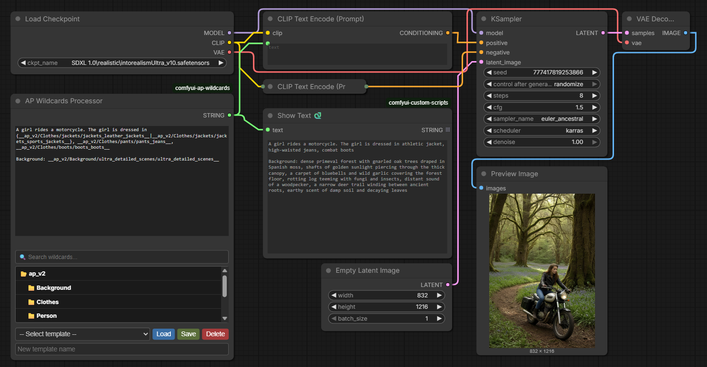

### 🚀 Features

- **Nested folders support** – JSON files can be organized in any folder depth.
- **Hierarchical category picker** – tree view with icons 📁/📂 and search.
- **Instant insertion** – selected category added as `__path/to/category__`.
- **Curly braces handling** – `{option1|option2|...}` picks a random option.
- **Nested braces and common suffix** – correct handling of deep nesting and suffixes after `|`.
- **Templates** – save, load, and delete prompts (stored in `templates.json`).
- **Dynamic height** – category block adjusts to node size (60–300px).
- **Auto‑created example** – `wildcards/example.json` created on first run.

### 📥 Installation

1. Go to `custom_nodes` folder of your ComfyUI.
2. Clone the repository:
   ```bash
   git clone https://github.com/yourusername/comfyui-ap-wildcards.git
   ```
   (or download ZIP and extract to `custom_nodes/comfyui-ap-wildcards`)
3. Restart ComfyUI.

### 🗂 Structure

```
comfyui-ap-wildcards/
├── __init__.py
├── nodes/
│   └── ap_wildcards.py
├── web/
│   └── js/
│       └── ap-wildcards.js
├── wildcards/                (auto‑created)
│   ├── example.json
│   └── your_files.json
└── templates.json            (created when saving a template)
```

### 📝 Wildcard file format

```json
{
    "animals": ["cat", "dog", "elephant", "tiger"],
    "colors": ["red", "green", "blue", "yellow"]
}
```

If the file is inside `ap/person/face_types.json`, the category will be `ap/person/face_types/face_shapes`.

### 🔧 Usage

1. Add **AP Wildcards Processor** node to your workflow.
2. Enter text or load a template.
3. Find category via search or expand folders.
4. Click on category – it will be added as `__category__`.
5. Click **Queue Prompt** – all `__...__` will be replaced with random values.

### Curly braces constructs

- `{cat|dog}` → random choice.
- `{A|B, common suffix}` → `A, suffix` or `B, suffix`.
- Nested braces: `{A|B, {C|D}}` processed from innermost outward.

### Templates

- **Save** – enter name in "New template name" field → Save.
- **Load** – select template → Load.
- **Delete** – select template → Delete (confirmation).

### ⚙️ Configuration

- Minimum node height – 400px (set automatically).
- Category block height – 60 to 300px, dynamic.
- Auto‑refresh on JSON file changes.

### 🐛 Troubleshooting

- **Category list not showing** – ensure there are JSON files in `wildcards`.
- **Loading error** – check browser console (F12) and ComfyUI console.
- **Templates not saving** – check write permissions in node folder.
